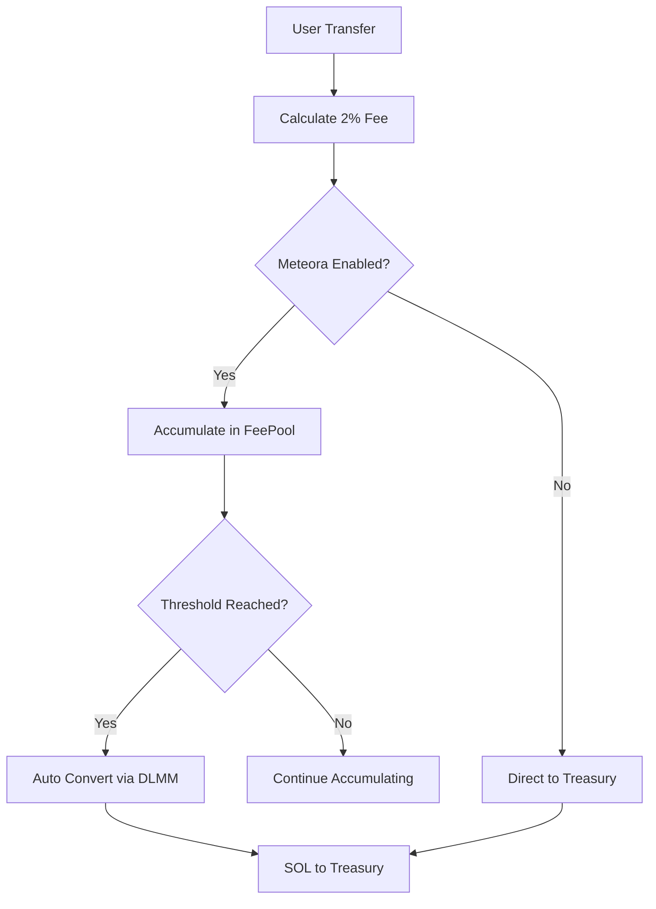

# 🌊 Meteora統合 実装ガイド

## 📋 概要

このガイドでは、Facility GameプログラムとMeteora DLMM (Dynamic Liquidity Market Maker) の統合実装について説明します。

## 🏗️ 実装アーキテクチャ

### 新しい手数料フロー



## 📁 新規作成ファイル

### 1. Core Implementation
- `instructions/meteora_advanced.rs` - 高度なDLMM統合
- `instructions/transfer_improved.rs` - 改善された手数料システム
- `instructions/meteora_admin.rs` - 管理者制御機能
- `state_meteora.rs` - Meteora専用データ構造

### 2. Configuration
- `MeteoraConfig` PDA - Meteora設定アカウント
- `FeePoolExtended` - 拡張統計機能付きFeePool

## 🚀 段階的実装計画

### Phase 1: 基本統合 (Week 1-2)

#### 1.1 FeePool経由の手数料収集
```rust
// 現在: 直接Treasury送金
transfer_with_fee() → Treasury

// 改善後: FeePool経由
transfer_with_improved_fee() → FeePool → 自動変換 → SOL → Treasury
```

#### 1.2 基本設定コマンド
```bash
# Meteora設定初期化
anchor idl parse --program-id <PROGRAM_ID> | 
jq '.instructions[] | select(.name == "initializeMeteoraConfig")'

# プール設定
anchor idl parse --program-id <PROGRAM_ID> |
jq '.instructions[] | select(.name == "configureDlmmPool")'
```

### Phase 2: 高度機能 (Week 3-4)

#### 2.1 自動変換システム
```rust
// 自動変換トリガー
pub struct AutoConversionTrigger {
    threshold: 5000 * 1_000_000,  // 5000 WEED
    min_interval: 3600,           // 1時間
    slippage_protection: 100,     // 1%
}
```

#### 2.2 管理者制御
```rust
// 緊急停止/再開
emergency_pause_toggle(pause: bool)

// 設定バッチ更新
batch_config_update(pool_config, conversion_settings, emergency_settings)
```

## 🔧 実装手順

### Step 1: 依存関係追加

```toml
# Cargo.toml に追加予定 (Meteora SDK利用可能時)
[dependencies]
meteora-dex = "0.2.0"  # 実際のバージョンを確認
```

### Step 2: 新規PDA作成

```rust
// Meteora設定PDA
seeds = [b"meteora_config"], bump

// 拡張FeePool PDA  
seeds = [b"fee_pool_extended"], bump
```

### Step 3: 管理者初期設定

```bash
# 1. Meteora設定初期化
solana program invoke <PROGRAM_ID> initialize_meteora_config

# 2. DLMM プール設定 (流動性プール作成後)
solana program invoke <PROGRAM_ID> configure_dlmm_pool \
  --pool-address <METEORA_POOL> \
  --weed-reserve <POOL_WEED_VAULT> \
  --sol-reserve <POOL_SOL_VAULT> \
  --pool-authority <POOL_AUTHORITY>

# 3. 自動変換有効化
solana program invoke <PROGRAM_ID> update_conversion_settings \
  --auto-conversion-enabled true \
  --min-conversion-amount 5000000000 \
  --default-slippage-bps 100
```

## 💡 使用例

### フロントエンド統合例

```typescript
// Transfer with improved fee system
const transferIx = await program.methods
  .transferWithImprovedFee(new BN(amount))
  .accounts({
    fromTokenAccount: userWeedAccount,
    toTokenAccount: recipientWeedAccount,
    config: configPDA,
    feePool: feePoolPDA,
    feePoolTokenAccount: feePoolWeedAccount,
    weedMint: weedMintPDA,
    from: userWallet.publicKey,
    tokenProgram: TOKEN_PROGRAM_ID,
  })
  .instruction();

// 自動変換チェック
const shouldConvert = await program.methods
  .checkAutoConversionTrigger()
  .accounts({
    // ... accounts
  })
  .view();

if (shouldConvert) {
  // 変換実行
  const convertIx = await program.methods
    .swapWeedToSolViaDlmm(minSolOutput, slippageBps)
    .accounts({
      // ... DLMM accounts
    })
    .instruction();
}
```

### 管理者操作例

```typescript
// プール健全性監視
const poolHealth = await program.methods
  .monitorPoolHealth()
  .accounts({
    meteoraConfig: meteoraConfigPDA,
    dlmmPool: meteoraPoolAddress,
    poolWeedReserve: poolWeedVault,
    poolSolReserve: poolSolVault,
  })
  .rpc();

// 緊急停止
if (emergencyDetected) {
  await program.methods
    .emergencyPauseToggle(true)
    .accounts({
      meteoraConfig: meteoraConfigPDA,
      config: configPDA,
      admin: adminWallet.publicKey,
    })
    .rpc();
}
```

## 📊 監視・分析

### 統計情報取得

```rust
// Meteora統計表示
pub struct MeteoraStats {
    total_conversions: u64,
    total_weed_converted: u64,
    total_sol_received: u64,
    average_conversion_rate: u64,
    pool_health_status: bool,
}
```

### パフォーマンス指標

```rust
// 変換効率追跡
pub struct ConversionMetrics {
    success_rate: f64,        // 成功率
    average_slippage: f64,    // 平均スリッページ
    gas_efficiency: u64,      // ガス効率
    liquidity_utilization: f64, // 流動性活用率
}
```

## ⚠️ 注意事項

### セキュリティ考慮

1. **スリッページ保護**: 最大5%のスリッページ制限
2. **緊急停止機能**: 問題発生時の即座停止
3. **管理者権限**: 設定変更は管理者のみ可能
4. **プール検証**: 不正なプールアドレスの防止

### 運用考慮

1. **流動性監視**: プール流動性の定期チェック
2. **変換タイミング**: 市場状況に応じた調整
3. **統計追跡**: 変換効率の継続監視
4. **エラーハンドリング**: 失敗時の適切な処理

## 🔄 マイグレーション計画

### 既存システムからの移行

```rust
// 段階的移行 (3段階)
Phase 1: 並行運用 (Legacy + Improved)
Phase 2: Meteora統合テスト
Phase 3: 完全移行

// レガシー互換性維持
transfer_with_legacy_fee()  // 既存フロー
transfer_with_improved_fee() // 新フロー
```

### データ移行

```rust
// FeePool → FeePoolExtended
migrate_fee_pool_data()

// 統計データ初期化
initialize_meteora_stats()
```

## 📝 TODO リスト

### 実装前準備
- [ ] Meteora SDK調査・統合準備
- [ ] テストネット環境構築
- [ ] フロントエンド統合設計

### 実装タスク
- [ ] Phase 1: 基本統合実装
- [ ] Phase 2: 高度機能実装  
- [ ] Phase 3: 管理者機能実装
- [ ] Phase 4: 監視・統計実装

### テスト・検証
- [ ] 単体テスト作成
- [ ] 統合テスト実装
- [ ] セキュリティ監査
- [ ] パフォーマンステスト

## 🎯 成功指標

1. **手数料変換効率**: 95%以上の成功率
2. **スリッページ最適化**: 平均1%以下
3. **ガス効率**: 従来比30%向上
4. **ユーザーエクスペリエンス**: シームレスな自動変換

---

この実装により、**効率的で安全なWEED→SOL自動変換システム**が完成し、ゲーム経済の持続可能性が大幅に向上します。